# beauty-hora
project voor backend web
# 💇‍♀️ Beauty Hora — Laravel 12 Webapp

**Beauty Hora** is een dynamische webapplicatie gebouwd met Laravel 12, als eindproject voor het vak **Backend Web**.

---

## 🌐 Projectbeschrijving

Beauty Hora is een professionele schoonheidssalon website met boekingssysteem, nieuws, FAQ, gebruikersbeheer en meer. Zowel bezoekers als ingelogde gebruikers kunnen ermee werken. Admins hebben toegang tot contentbeheer en moderatiepanelen.

---

## ⚙️ Functionaliteiten

### 👤 Authenticatie

- Registreer / Login / Wachtwoord vergeten
- 'Remember me' functionaliteit
- Eén default admin account (zie onderaan)

### 👥 Gebruikersbeheer

- Publieke profielpagina voor elke gebruiker
- Gebruiker kan eigen gegevens bewerken (foto, bio, naam, verjaardag)
- Admins kunnen andere gebruikers admin maken of verwijderen

### 📰 Nieuwsitems

- Admins kunnen nieuws toevoegen, bewerken, verwijderen
- Publiek kan alle nieuws bekijken (lijst + detail)
- Inhoud: titel, afbeelding, content, publicatiedatum

### 💬 Commentaren

- Ingelogde gebruikers kunnen reageren op nieuwsitems
- Admins modereren reacties

### ❓ FAQ

- Bezoekers zien FAQ per categorie
- Admins kunnen vragen + categorieën beheren
- Bezoekers kunnen vragen voorstellen
- Admins keuren suggesties goed (of niet)

### 📅 Boeking systeem

- Auth-gebruikers kunnen een afspraak boeken
- Admin ziet alle boekingen in overzicht

### 📞 Contactformulier

- Bezoekers kunnen contact opnemen
- Admin ontvangt mail bij verzending

### 🛠 Extra's

- Specialisaties many-to-many (tussen users en services)
- Adminpanel voor specialisatiebeheer
- Mooi navmenu afhankelijk van rol (admin/user)
- Mooie loginpagina met achtergrond

---

## 🗃 Models & Relaties

- **User ↔ Services** (many-to-many)
- **News → Comments** (one-to-many)
- **FaqCategory → Faq** (one-to-many)
- **User → News** (one-to-many auteurrelatie)

---

## 📁 Structuur en Bestanden

Alle routes via controllers  
Alle forms met CSRF  
Client-side validation  
Auth policies voor rechtenbeheer  
Gebruik van Laravel components (nav-link, layouts, dropdowns)

---

## 🛠 Technische implementatie (met lijnnummers)
Hieronder een overzicht van de belangrijkste vereisten en waar ze terug te vinden zijn in de code:

| Vereiste                        | Bestandslocatie(s)                                                                 | Regel(s) / Beschrijving                                                                 |
|--------------------------------|-------------------------------------------------------------------------------------|------------------------------------------------------------------------------------------|
| 🔐 Login/Register/Reset        | `routes/auth.php`, `app/Http/Controllers/Auth/*`                                   | Standaard via Laravel Breeze                                                            |
| 🛡️ Admin middleware            | `routes/web.php`                                                                   | Lijnen **47–70**, bv. `Route::middleware(['auth', 'can:admin'])`                        |
| 👤 Profielpagina publiek        | `routes/web.php`, `ProfileController@show`                                         | Route op lijn **28** + controller `show()` methode                                      |
| ✏️ Profiel bewerken            | `routes/web.php`, `ProfileController@edit/update`                                  | Lijnen **63–65** + controller methoden                                                  |
| 📰 Nieuws CRUD (admin)         | `routes/web.php`, `NewsController`                                                 | Routes op lijnen **47–55**, controller bevat `create`, `store`, `edit`, `update`, ...  |
| 🌍 Nieuws publiek zichtbaar    | `routes/web.php`, `NewsController@index/show`                                      | Lijnen **42–44 & 57–58**                                                                |
| 💬 Comments (1:N)              | `app/Models/News.php`, `Comment.php`, `routes/web.php`, `CommentController`        | `comments()` relatie in `News.php`, `store()` in `CommentController`                   |
| 🧹 Comment moderatie (admin)   | `routes/web.php`, `CommentController@index/approve/destroy`                        | Routes op **110–113**, logica in controller                                            |
| ❓ FAQ & categorieën (admin)   | `routes/web.php`, `FaqController`, `FaqCategoryController`                         | Resource controllers, lijnen **73–75**                                                  |
| 💡 FAQ suggesties              | `routes/web.php`, `FaqSuggestionController`                                        | Lijnen **116–121**, controller `create`, `store`, `approve`, `destroy`                 |
| 📅 Boekingen CRUD              | `routes/web.php`, `BookingController`                                              | Lijnen **85–92**, methodes `create`, `store`, `myBookings`, `cancel`                   |
| 📧 Contactformulier + mail     | `routes/web.php`, `ContactController@create/store`, `Mail::to()`                   | Lijnen **78–79**, mail verzonden in `store()`                                           |
| 🧬 Specialisaties many-to-many | `User.php`, `Service.php`, pivot table + `Admin/SpecializationController`         | `belongsToMany()` relatie in beide models + admin CRUD                                  |


## 🧪 Installatiehandleiding

1. Clone de repo:
   ```bash
   git clone <https://github.com/milatxx/beauty-hora>
   cd beauty-hora

2. Installeer dependencies:
   composer install
   npm install && npm run build

3. Configureer .env:
   cp .env.example .env
   php artisan key:generate

4. Run migraties + seeders:
   php artisan migrate:fresh --seed

5. Start lokale server:
   php artisan serve

6. (Optioneel) Link storage:
   php artisan storage:link

## 🧪 Default admin account

Rol: Admin

Email: admin@ehb.be

Wachtwoord: Password!321

## 📸 Screenshots
### 🔐 Authenticatie

#### Loginpagina  
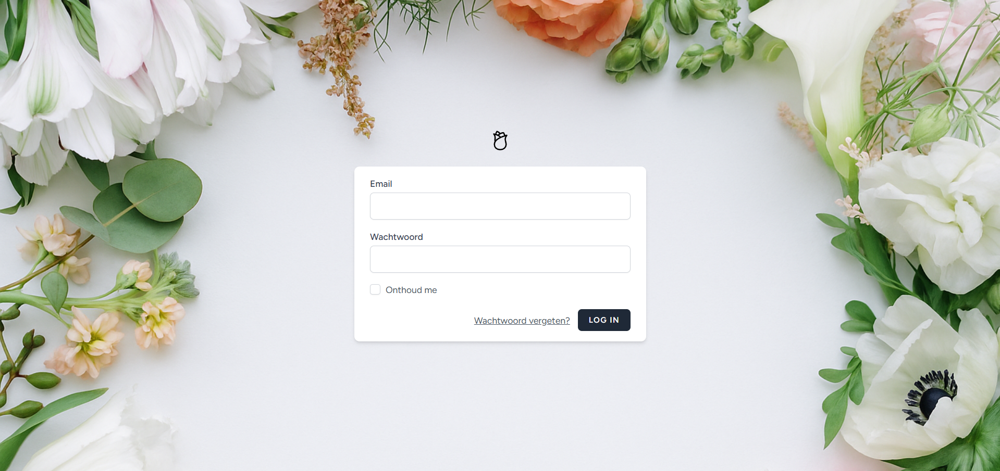

#### Registerpagina  
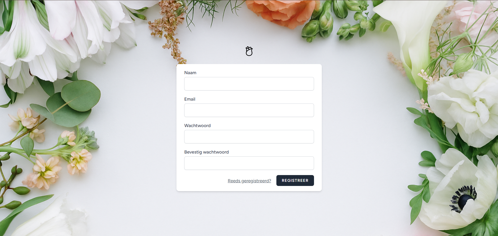

---

### 🏠 Publieke Pagina’s

#### Homepagina / Dashboard  


#### Profielpagina (publiek en bewerkbaar)  
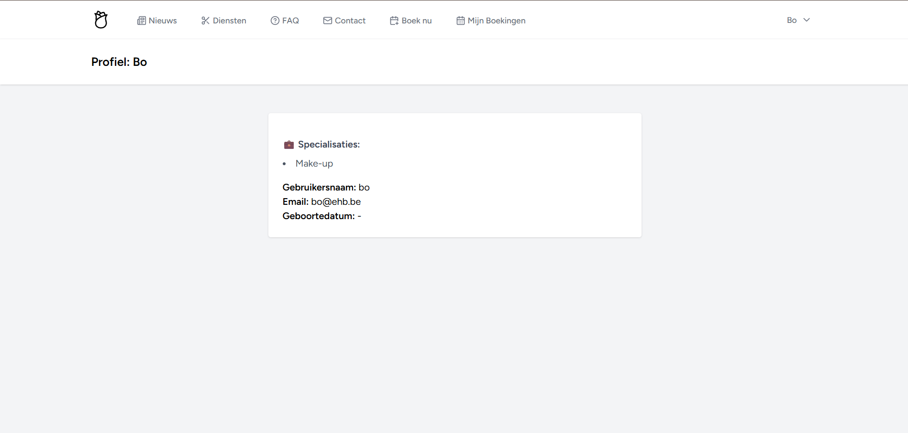
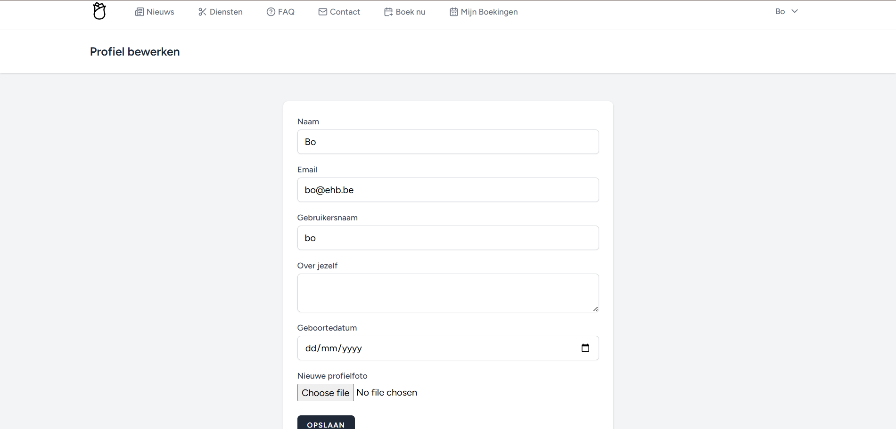

---

### 📰 Nieuws

#### Overzichtspagina van nieuwsitems  
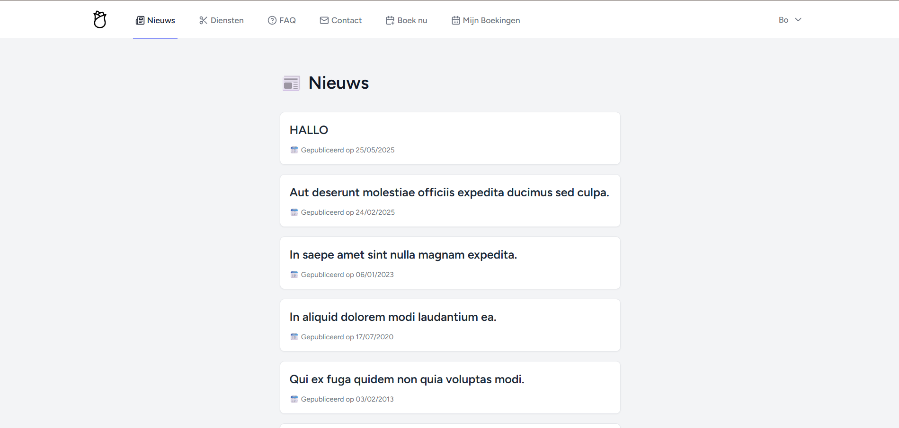

#### Detailpagina van één nieuwsitem  
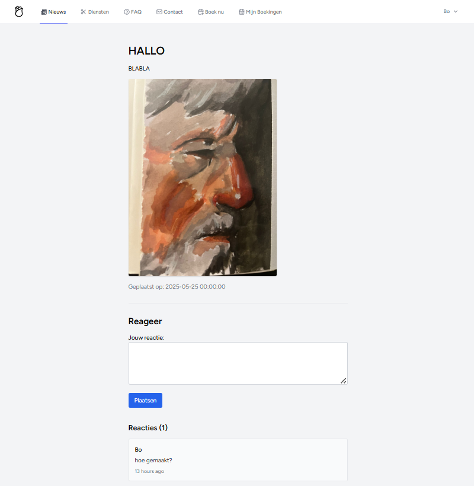

---

### 💬 Commentaren

#### Nieuwsitem met reacties van gebruikers  
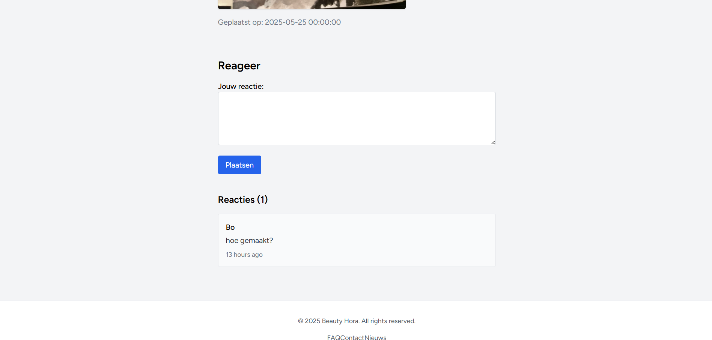

#### Adminpaneel om reacties te modereren  
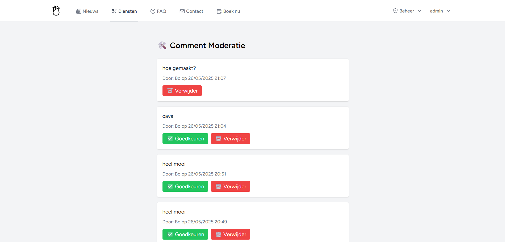

---

### 📚 FAQ

#### Publieke FAQ-pagina (met categorieën)  
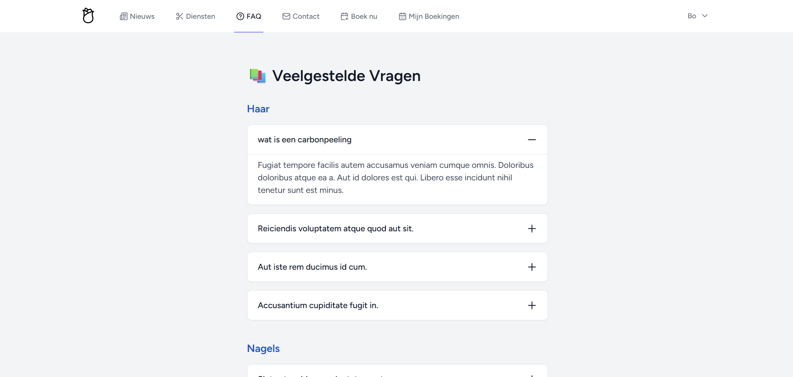

#### Adminpaneel om FAQ & categorieën te beheren  
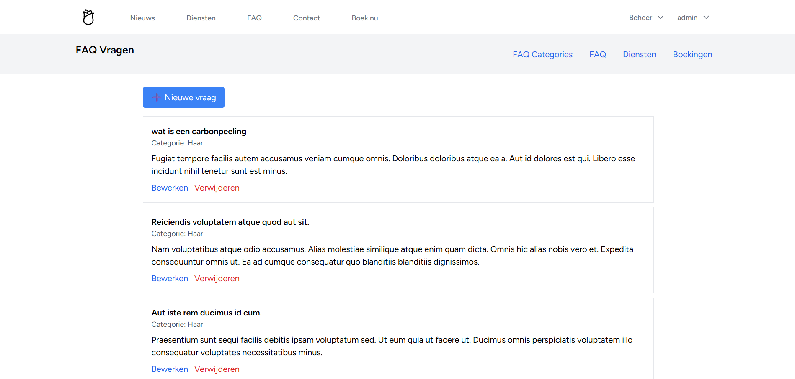
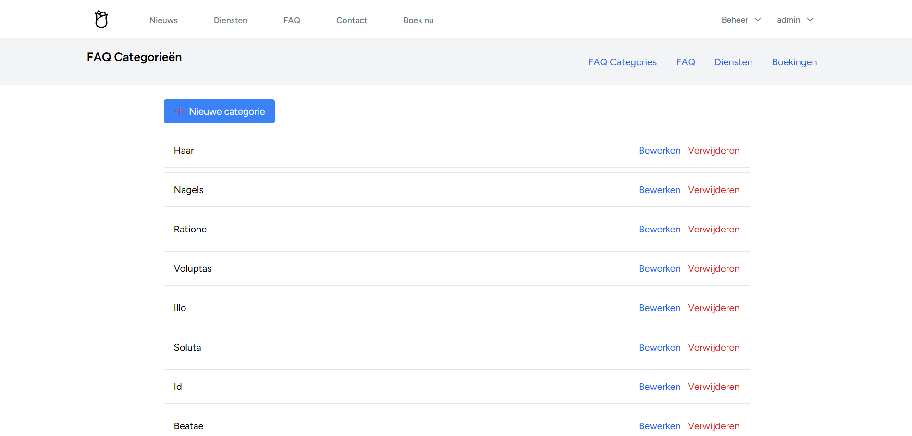

---


### 📅 Boekingen

#### Boekingsformulier voor gebruikers  
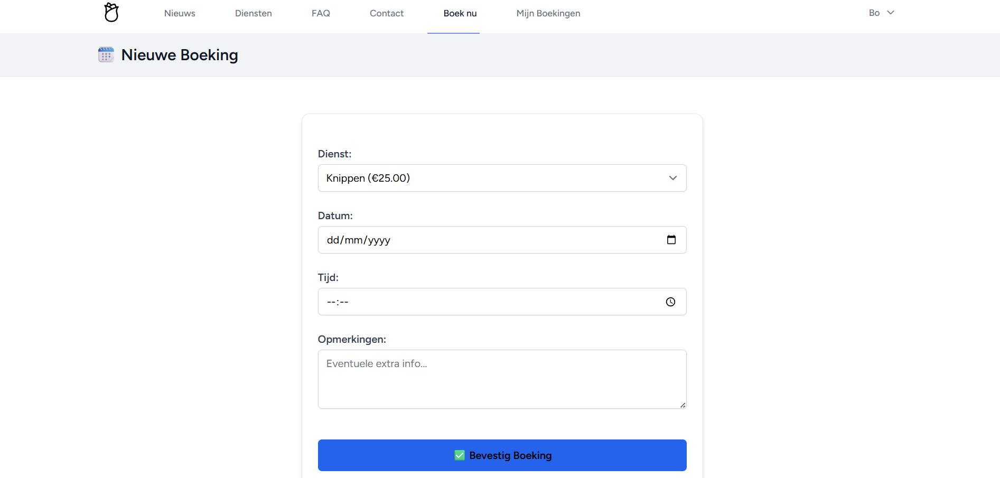

#### Admin-overzicht van boekingen  
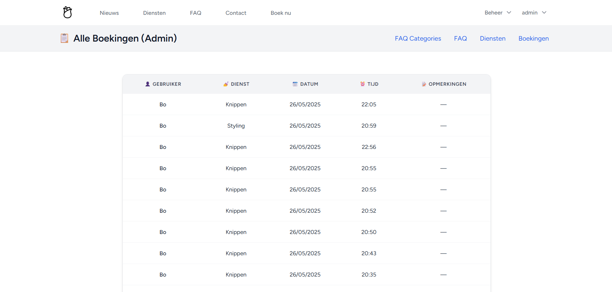

---

### 📞 Contact

#### Contactformulier  
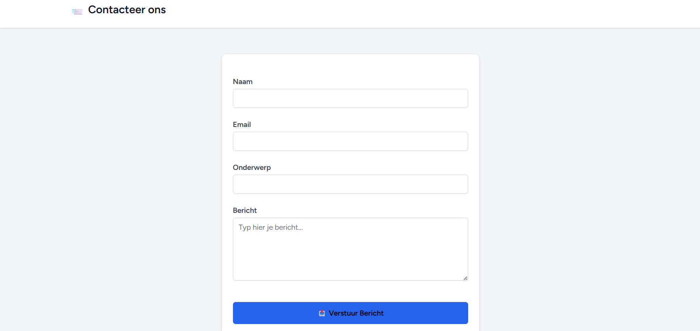

---

### 🧑‍💼 Adminbeheer

#### Admin dashboard  
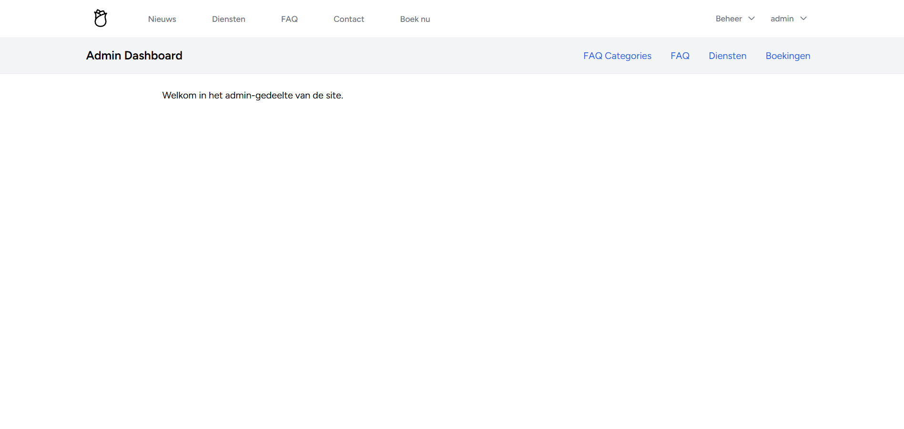

#### Gebruikerslijst met admin-toggle  


#### Specialisaties beheren  
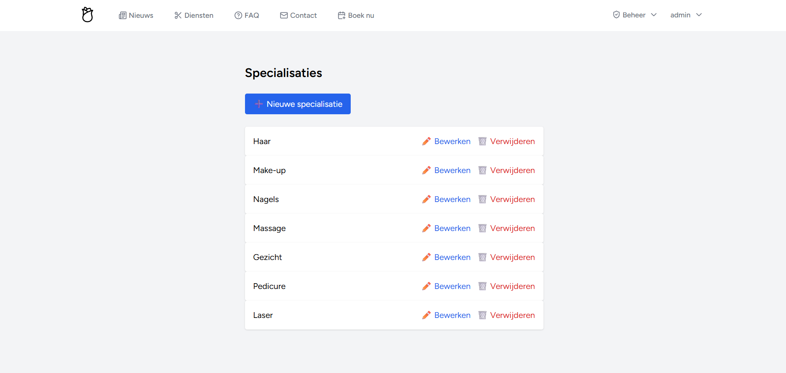

#### Services beheren  
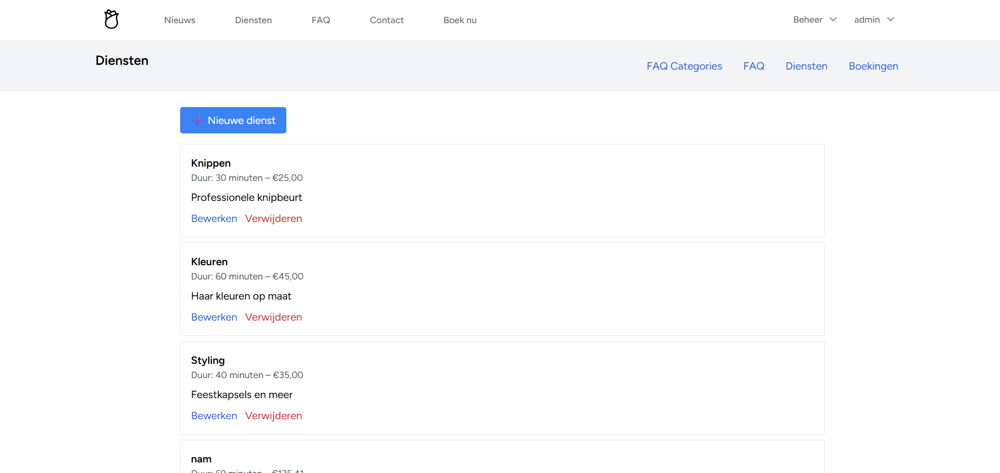


## 📚 Gebruikte bronnen

- Laravel Docs
- Laravel Breeze
- Lucide Icons
- ChatGPT (assistentie bij debugging en structuur)

Laatste update: 27-05-2025
